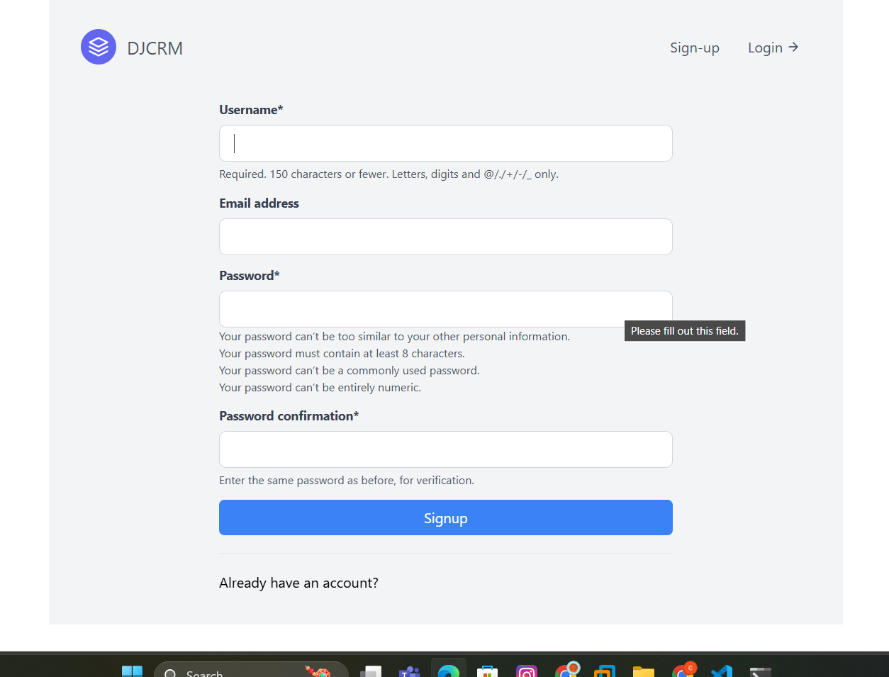
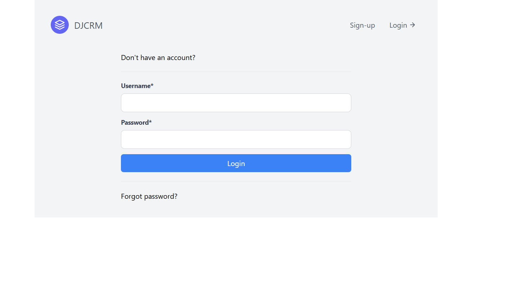
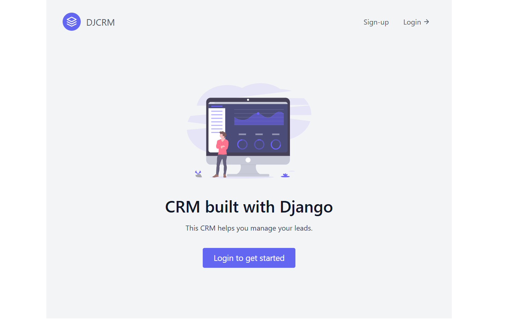
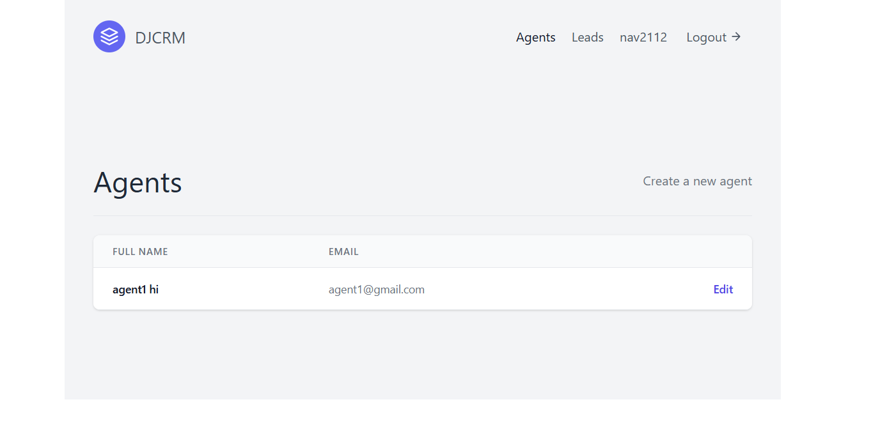
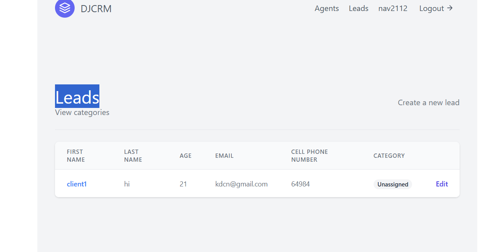
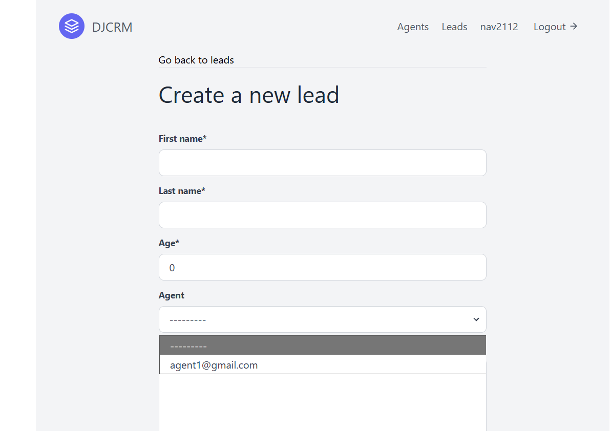

# Client Relationship Management System (CRM)

A **Full-Stack Web Application** built with **Django**, **PostgreSQL**, and **Bootstrap** that enables organizations to manage client relationships, assign leads, and track progress efficiently.

---

## 📌 Overview
This CRM application is designed for **small to medium-sized organizations** to efficiently manage:
- **Organizers** (organization heads)
- **Agents** (field employees)
- **Leads** (clients)

It provides **role-based access**, a **dashboard**, and tools for **categorizing leads** based on work type or industry.

---

## 🚀 Features

### 🔑 Authentication & Roles
- **Role-based Access Control**:
  - **Organizer** – Full access to manage agents and leads.
  - **Agent** – Can only manage assigned leads.
  - **Lead** – Client information stored for tracking.
- Secure login system.

### 📋 Lead Management
- Organizers can:
  - Create **agents** and **leads**.
  - Assign leads to specific agents.
  - Classify leads into **custom categories**.
- Agents can:
  - View assigned leads.
  - Update lead status.

### 📊 Dashboard
- Displays **current status** of all leads.
- Tracks **lead progress**.

---

## 🖼️ Screenshots

### Sign Up


### Sign In


### Dashboard


### Agent Dashboard


### Lead Dashboard


### Create Lead


---

## 🛠 Tech Stack
- **Backend** – Django
- **Frontend** – HTML, CSS, Bootstrap
- **Database** – PostgreSQL
- **Authentication** – Django Auth
- **Deployment** – Vercel / Any preferred platform

---

## ⚙️ Installation & Setup

### 1️⃣ Clone the Repository
```bash
git clone https://github.com/YOUR_USERNAME/CRM.git
cd CRM/_CRM
